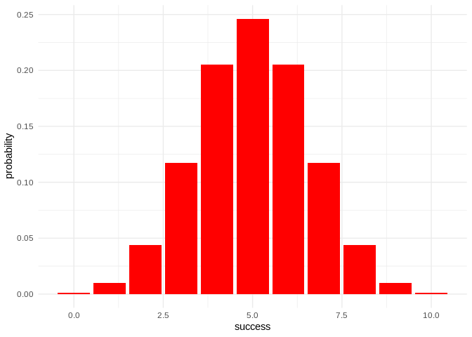
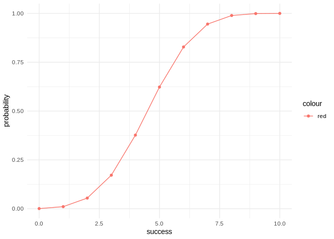

README
================
yilin-wu
May 3, 2019

Overview
--------

`"binomial"` is a minimal R package that provides some related functions and measurements for binomial distribution.

`"bin_variable()"` creates a binomial object with arguments `trials` and `prob`

`"bin_probability()"` calculates the probability given `success` , `trials` and `prob`

`"bin_choose()"` calculates the number of combination given `n` and `k`

`"summary()"` gives the summary of that binomial object

`"bin_mean()"` gives the mean given `trials` and `prob`

`"bin_variance()"` gives the variance given `trials` and `prob`

`"bin_mode()"` gives the mode given `trials` and `prob`

`"bin_skewness()"` gives the skewness given `trials` and `prob`

`"bin_kurtosis()"` gives the kurtosis given `trials` and `prob`

`"bin_distribution()"` returns the binomial distribution given the arguments `trials` and `prob`

`"bin_cumulative()"` returns the cumulative probability for binomial distribtuion given the arguments `trials` and `prob`

`"plot()"` returns a barplot for bin\_distribution and scatterplot with line for bin\_cumulative

Motivation
----------

This package has been developed to illustrate some of the concepts behind the creation of an R package.

Installation
------------

Install the development version from GitHub via the package "devtools":

Usage
-----

    ## Binomial variable
    ## Parameters
    ## -number of trials: 10
    ## -prob of success: 0.5

    ## [1] 0.2460938

    ## [1] 120

    ## Summary Binomials
    ## Parameters
    ## -number of trials: 10
    ## -prob of success: 0.5
    ## Measures
    ## -mean: 5
    ## -variance: 2.5
    ## -mode: 5
    ## -skewness: 0
    ## -kurtosis: -0.2

    ## [1] 5

    ## [1] 2.5

    ## [1] 5

    ## [1] 0

    ## [1] -0.2

    ## Warning in if (!(round(success) == success) | any(success < 0) == TRUE) {:
    ## the condition has length > 1 and only the first element will be used

    ## Warning in if (n < k) {: the condition has length > 1 and only the first
    ## element will be used

    ##    success  probability
    ## 1        0 0.0009765625
    ## 2        1 0.0097656250
    ## 3        2 0.0439453125
    ## 4        3 0.1171875000
    ## 5        4 0.2050781250
    ## 6        5 0.2460937500
    ## 7        6 0.2050781250
    ## 8        7 0.1171875000
    ## 9        8 0.0439453125
    ## 10       9 0.0097656250
    ## 11      10 0.0009765625

    ## Warning in if (!(round(success) == success) | any(success < 0) == TRUE) {:
    ## the condition has length > 1 and only the first element will be used

    ## Warning in if (!(round(success) == success) | any(success < 0) == TRUE) {:
    ## the condition has length > 1 and only the first element will be used

    ##    success  probability   cumulative
    ## 1        0 0.0009765625 0.0009765625
    ## 2        1 0.0097656250 0.0107421875
    ## 3        2 0.0439453125 0.0546875000
    ## 4        3 0.1171875000 0.1718750000
    ## 5        4 0.2050781250 0.3769531250
    ## 6        5 0.2460937500 0.6230468750
    ## 7        6 0.2050781250 0.8281250000
    ## 8        7 0.1171875000 0.9453125000
    ## 9        8 0.0439453125 0.9892578125
    ## 10       9 0.0097656250 0.9990234375
    ## 11      10 0.0009765625 1.0000000000

Note that the `echo = FALSE` parameter was added to the code chunk to prevent printing of the R code that generated the plot.
