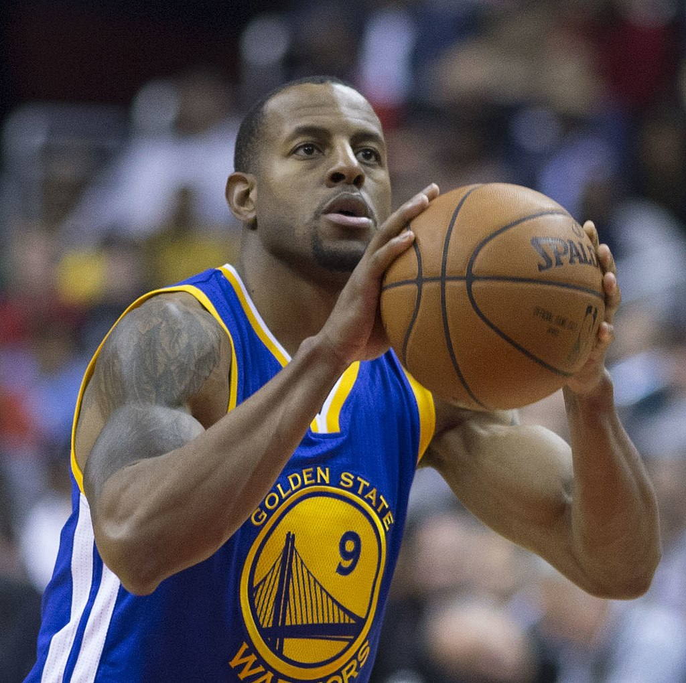
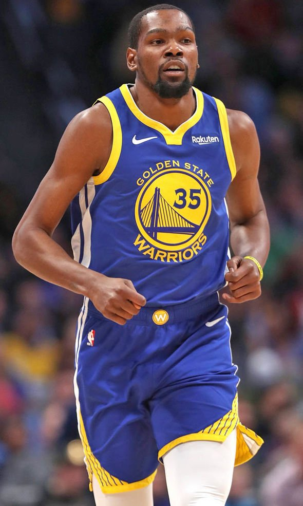
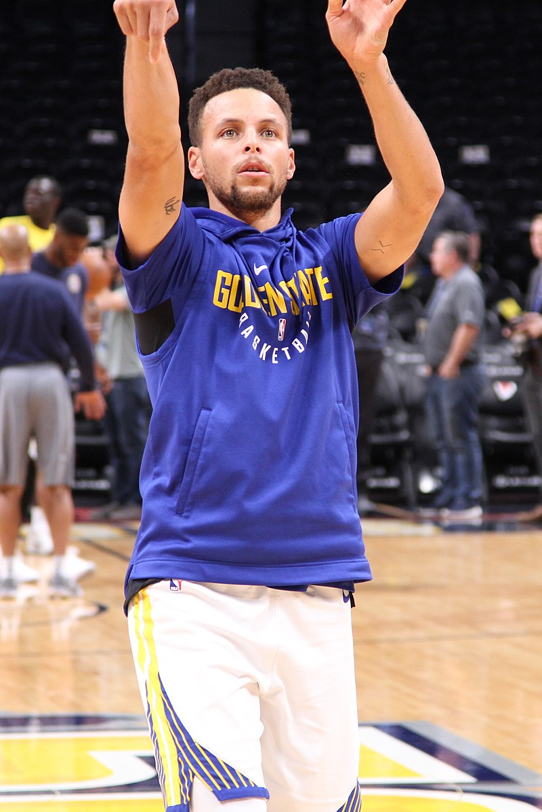
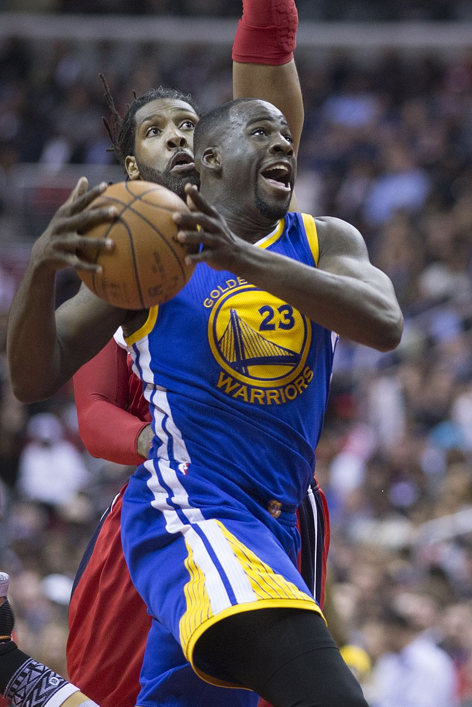
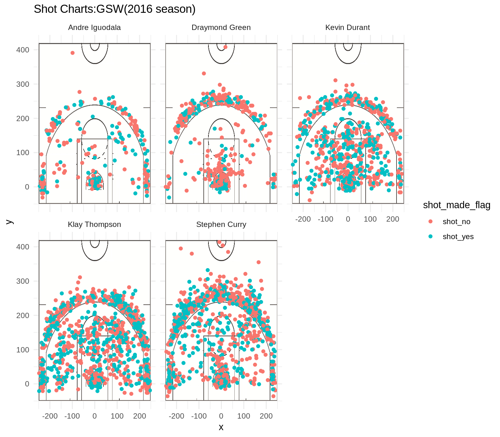

Workout 1
================
Yilin Wu
March 10, 2019

-   [How Golden State Warriors achieve success](#how-golden-state-warriors-achieve-success)
    -   [Introduction](#introduction)
    -   [Background](#background)
    -   [Data](#data)
    -   [Analysis](#analysis)
    -   [Conclusions](#conclusions)
    -   [Reference](#reference)
    -   [Appendix for important materials](#appendix-for-important-materials)

How Golden State Warriors achieve success
=========================================

Introduction
------------

**Golden State Warriors** is a super strong teams in NBA, wining 3 championships in the past four years. The five core players who lay foundation for the Golden State Warriors' dynasty in NBA are **Andre Iguodala**, **Graymond Green**, **Kevin Durant**, **Klay Thompson**, **Steven Curry**. Why this team can attain so much achievement has never failed to arouse public interest. Today, we will show you why they have a great strength over other NBA teams through analyzing their shooting, especially the ones of their five major players.

------------------------------------------------------------------------

Background
----------

The Golden State Warriors are an American professional basketball team based in Oakland, California. They are part of the Pacific Division of the Western Conference in the National Basketball Association (NBA).

The introduction for five major players

**Andre Iguodala**:

an American professional basketball player for the Golden State Warriors of the National Basketball Association (NBA). The swingman was an NBA All-Star in 2012 and has been named to the NBA All-Defensive Team twice. Iguodala won an NBA championship with the Warriors in 2015, when he was named the NBA Finals Most Valuable Player. He was changed from the starting rotation to the sixth man reserve position and played as a great defender of LeBron James.



**Kevin Durant**:

He played nine seasons in Oklahoma City before signing with Golden State in 2016, winning back-to-back championships in 2017 and 2018. His primary position is small forward and his career averages are 27.1 points, 7.1 rebounds, and 3.9 assists per game.Widely regarded as one of the best players of his generation, Durant has earned All-NBA honors eight times (2009–14, 2016–18) and was voted Rookie of the Year in his debut season. He has also won an MVP Award and finished second in the voting three times, a trend that he has expressed frustration over.



**Stephen Curry**:

Curry plays almost exclusively at the point guard position and has career averages of 23.1 points, 6.8 assists, 4.4 rebounds, and 1.8 steals per game.He is a high-percentage free throw shooter, with a career free throw percentage of over 90% through the 2017–18 season. Curry's shooting ability ranges from scoring in great volume from underneath the rim all the way to near half-court.Using an unorthodox jump shot, he is able to get the ball out of his hands in under half a second by releasing it on the way up, adding extra arc to his shot and making it difficult to block.



**Klay Thompson**:

Thompson is both a prolific and efficient shooter, particularly from range, as well as an elite free-throw shooter. He relies upon a shooting form that has been described as "textbook" and "picture-perfect".Though he is capable of handling the ball in the Warriors offense, Thompson is primarily a catch-and-shoot player, taking advantage of back-cuts and screens set by teammates to make space for his exceptionally accurate quick-release shot.


**Draymond Green**:

Though he is considered undersized for a power forward at 6 feet 7 inches (2.01 m), Green is a versatile defender, capable of guarding all 5 positions as both an interior and perimeter defender. Green studies opponents' habits, and leverages his preparation along with his muscular frame and lower-body strength, and is capable of generating rebounds, steals and blocks. He has been named to multiple NBA All-Defensive Teams, and was named the 2016-17 NBA Defensive Player of the Year.



The shot types of NBA are two kinds: 2-point shooting which means getting 2 points if shot is made. 3-point shooting indicating 3 points. They are determined by the distance to the basket.


------------------------------------------------------------------------

Data
----

We have gathered the data of the five players shooting in all the games they played in season 2016-2017. After combining their data into a whole table, we are able to show the summary of their shooting and do some preprocessing of the data to better support our later analysis.

------------------------------------------------------------------------

Analysis
--------

-   First we analyze the effective shooting of the five palyers.
    1.  the 2-point shooting made by players
        obviously from the table we can see that Andre Iguodala is the person who has the highest efficiency while Kevin Durant has made the most shots.

    2.  the 3-point shooting made by players
        Clearly from the table, we can see that Klay Thompson has the highest effective shooting percentage while stephen currry makes the most 3-point shots. Additionally, we can draw a conclusion from the table that Curry andd Thompson are the major players in GSW that are responsible for 3-point shooting. This information can be detected because the total 3-point shots of these two players are far more than the other three players.
    3.  overall shooting made by players
        After analyzing the data in all kinds of shots, we can see that Curry and Thompson still get the highest chances to make shots while Kevin Durant has the highest efficiency.

    Below are charts and tables supporting for our analysis.


<table class="table" style="margin-left: auto; margin-right: auto;">
<caption>
2PT Effective Shooting % by Player
</caption>
<thead>
<tr>
<th style="text-align:left;">
name
</th>
<th style="text-align:right;">
total
</th>
<th style="text-align:right;">
made
</th>
<th style="text-align:right;">
perc\_made
</th>
</tr>
</thead>
<tbody>
<tr>
<td style="text-align:left;">
Andre Iguodala
</td>
<td style="text-align:right;">
210
</td>
<td style="text-align:right;">
134
</td>
<td style="text-align:right;">
0.6380952
</td>
</tr>
<tr>
<td style="text-align:left;">
Kevin Durant
</td>
<td style="text-align:right;">
643
</td>
<td style="text-align:right;">
390
</td>
<td style="text-align:right;">
0.6065319
</td>
</tr>
<tr>
<td style="text-align:left;">
Stephen Curry
</td>
<td style="text-align:right;">
563
</td>
<td style="text-align:right;">
304
</td>
<td style="text-align:right;">
0.5399645
</td>
</tr>
<tr>
<td style="text-align:left;">
Klay Thompson
</td>
<td style="text-align:right;">
640
</td>
<td style="text-align:right;">
329
</td>
<td style="text-align:right;">
0.5140625
</td>
</tr>
<tr>
<td style="text-align:left;">
Draymond Green
</td>
<td style="text-align:right;">
346
</td>
<td style="text-align:right;">
171
</td>
<td style="text-align:right;">
0.4942197
</td>
</tr>
</tbody>
</table>
<table>
<caption>
3PT Effective Shooting % by Player
</caption>
<thead>
<tr>
<th style="text-align:left;">
name
</th>
<th style="text-align:right;">
total
</th>
<th style="text-align:right;">
made
</th>
<th style="text-align:right;">
perc\_made
</th>
</tr>
</thead>
<tbody>
<tr>
<td style="text-align:left;">
Klay Thompson
</td>
<td style="text-align:right;">
580
</td>
<td style="text-align:right;">
246
</td>
<td style="text-align:right;">
0.4241379
</td>
</tr>
<tr>
<td style="text-align:left;">
Stephen Curry
</td>
<td style="text-align:right;">
687
</td>
<td style="text-align:right;">
280
</td>
<td style="text-align:right;">
0.4075691
</td>
</tr>
<tr>
<td style="text-align:left;">
Kevin Durant
</td>
<td style="text-align:right;">
272
</td>
<td style="text-align:right;">
105
</td>
<td style="text-align:right;">
0.3860294
</td>
</tr>
<tr>
<td style="text-align:left;">
Andre Iguodala
</td>
<td style="text-align:right;">
161
</td>
<td style="text-align:right;">
58
</td>
<td style="text-align:right;">
0.3602484
</td>
</tr>
<tr>
<td style="text-align:left;">
Draymond Green
</td>
<td style="text-align:right;">
232
</td>
<td style="text-align:right;">
74
</td>
<td style="text-align:right;">
0.3189655
</td>
</tr>
</tbody>
</table>
<table>
<caption>
Effective Shooting % by Player
</caption>
<thead>
<tr>
<th style="text-align:left;">
name
</th>
<th style="text-align:right;">
total
</th>
<th style="text-align:right;">
made
</th>
<th style="text-align:right;">
perc\_made
</th>
</tr>
</thead>
<tbody>
<tr>
<td style="text-align:left;">
Kevin Durant
</td>
<td style="text-align:right;">
915
</td>
<td style="text-align:right;">
495
</td>
<td style="text-align:right;">
0.5409836
</td>
</tr>
<tr>
<td style="text-align:left;">
Andre Iguodala
</td>
<td style="text-align:right;">
371
</td>
<td style="text-align:right;">
192
</td>
<td style="text-align:right;">
0.5175202
</td>
</tr>
<tr>
<td style="text-align:left;">
Klay Thompson
</td>
<td style="text-align:right;">
1220
</td>
<td style="text-align:right;">
575
</td>
<td style="text-align:right;">
0.4713115
</td>
</tr>
<tr>
<td style="text-align:left;">
Stephen Curry
</td>
<td style="text-align:right;">
1250
</td>
<td style="text-align:right;">
584
</td>
<td style="text-align:right;">
0.4672000
</td>
</tr>
<tr>
<td style="text-align:left;">
Draymond Green
</td>
<td style="text-align:right;">
578
</td>
<td style="text-align:right;">
245
</td>
<td style="text-align:right;">
0.4238754
</td>
</tr>
</tbody>
</table>
-   Then we display the shooting on the court and further analysis the effectiveness of shooting of different players in various positions on the court..

1.  From the chart, it is clear that compared to other three players, Curry and Thompson have more shots made near the 3-point arc and their success rate is also higher. This correponds to our anlaysis above. Interestingly, Curry seems to have better performance for 3-point shooting on the left side of the arc than the right side.

2.  Apart from the 3-point shooting, 2-point shooting also reveals a pattern among the five players. Apparently, Durant and Thompson made a lot of shots inside the 3-point arc and Curry has relatively less. Durant's success rate seems the highest among the three players.

3.  Iguodala and Green have obviously less shots than the other three players, which means shooting and getting point is not their main task in the team. Instead of a shooter, they may mainly serve as defenders to hinder opponents from getting more points.



------------------------------------------------------------------------

Conclusions
-----------

Based on the analysis above, we can safely arrives at the conclusion that the success of Golden State Warriors and the continuity of their dynasty in NBA largely attribute to the appropriate role each player serves in order to tap the fullest potential of the whole team. From both table analysis and the visulization of shots in courts, Curry and Thompson serve as 3-point shooters and Durant,mainly, as well as Thompson and Curry serve as 2-point shooters. Additionally, Green and Iguodala function as defenders. THe whole team collaborates together to beat the opponent.

Curry and Thompson may be the leaders and dominant shooter in the team because they have the highest shooting times and Iguodala and Durant are very effeicient and precise shooters because they have the highest percentage of made shots to total shots.

------------------------------------------------------------------------

Reference
---------

1.<https://en.wikipedia.org/wiki/Golden_State_Warriors>

2.<https://en.wikipedia.org/wiki/Stephen_Curry>

3.<https://en.wikipedia.org/wiki/Andre_Iguodala>

4.<https://en.wikipedia.org/wiki/Kevin_Durant>

5.<https://en.wikipedia.org/wiki/Klay_Thompson>

6.<https://en.wikipedia.org/wiki/Draymond_Green>

------------------------------------------------------------------------

Appendix for important materials
--------------------------------

For more details, you can see the corresponding summary of the team and each player in output folder

For *code*, you can see the R.script in code folders. some other codes for plotting that does not show in the R.script will briefly be shown below:

``` r
library(ggplot2)
library(tidyr)
gsw <- gsw_2pt_player
gsw$type <- "2-pt"
gsw[6:10,]<- gsw_3pt_player
gsw[6:10,"type"] <- "3-pt"
gsw[11:15,] <- gsw_player
gsw[11:15,"type"] <- "overall"
#plot 1
ggplot(gsw[1:10,],aes(x=name,y=total,fill=type))+
  geom_bar(stat='identity',position=position_dodge())+
  ggtitle("The total shots to total shots of different GSW players")+
  labs(x='GSW player',y='total shots')+
  geom_text(aes(label=total), vjust=1.6, color="white",
            position = position_dodge(0.9), size=3.5)+
  scale_fill_brewer(palette="Paired")+
  theme_minimal()
  
#plot 2
ggplot(gsw[1:10,],aes(x=name,y=made,fill=type))+
  geom_bar(stat='identity',position=position_dodge())+
  ggtitle("The made shots to total shots of different GSW players")+
  labs(x="GSW player",y="made shots")+
  geom_text(aes(label=made), vjust=1.6, color="white",
            position = position_dodge(0.9), size=3.5)+
  scale_fill_brewer(palette="Paired")+
  theme_minimal()

#plot 3
gsw$shots <- gsw$total
gsw[16:20,]<-gsw[11:15,]
gsw[16:20,]$shots <- gsw[11:15,]$made
gsw$shot_type <- "made"
gsw[11:15,]$shot_type <- "type"

ggplot(gsw[11:20,],aes(x=name,y=shots,fill=shot_type))+
  labs(x="GSW player",y="overal shots(2pt and 3pt)")+
  geom_bar(stat='identity',position = position_dodge())+
  ggtitle("The overall shots to total shots of different GSW players")+
geom_text(aes(label=shots), vjust=1.6, color="white",
            position = position_dodge(0.9), size=3.5)+
  scale_fill_brewer(palette="Paired")+
  theme_minimal()
# plot 4
ggplot(gsw,aes(x=name,y=perc_made*100,fill=type))+
  geom_bar(stat='identity',position = position_dodge())+
  labs(x="GSW player",y="percentage (%)of made shots to total shots")+
  ggtitle("The percentage of made shots to total shots of different GSW players")+
  geom_text(aes(label=round(perc_made*100)), vjust=1.6, color="white",
            position = position_dodge(0.9), size=3.5)+
  scale_fill_brewer(palette="Paired")+
  theme_minimal()
```

For *images*, you can see the photo of each player and team logo and all the plots in this documnet in images folder.

For *raw data and preprocessing data*, you can consult data folder

For *reports*, all the report-related files are stored in report folder.

Note that the `echo = FALSE` parameter was added to the code chunk to prevent printing of the R code that generated the plot.
